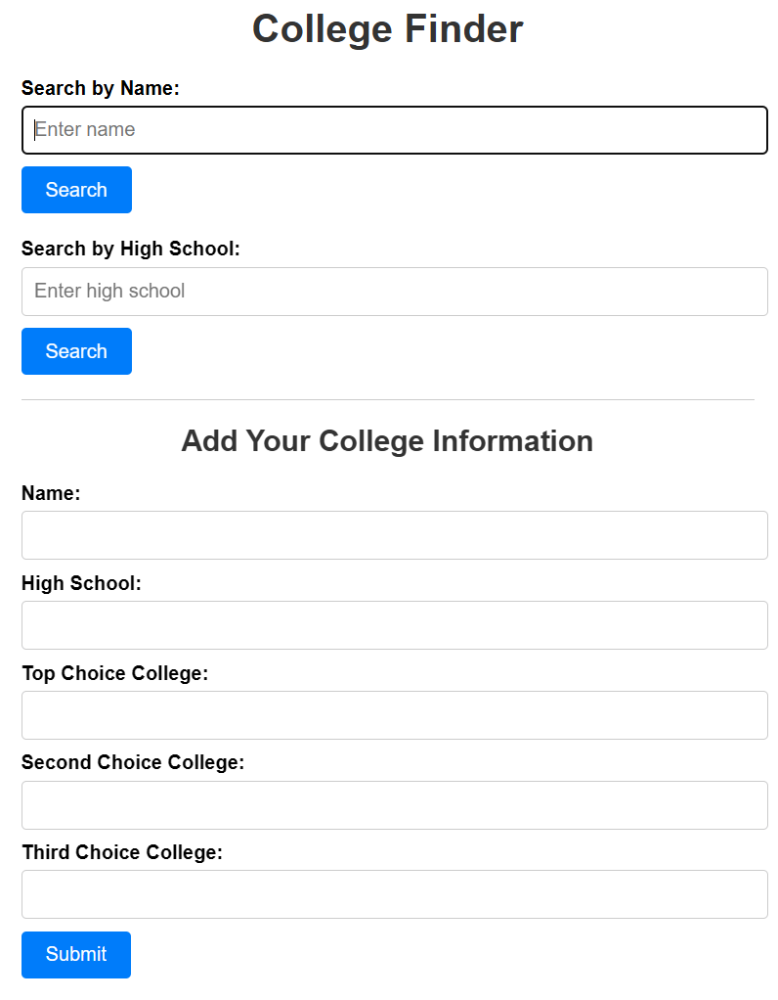

# College Choice Hub

Status: Completed software archive project

I built College Choice Hub as a student-facing web app so students could share and look up where classmates planned to attend college. The original version used PHP, SQL, and AJAX, then I later migrated it to Firebase hosting/backend services.

## Overview

This was one of my earlier larger web projects. It focused on a practical student workflow: quick lookup of college plans without requiring a heavy account system.

## Implementation

- Original stack: PHP, SQL, and AJAX
- Later migration: Firebase hosting and backend services
- Interface goal: simple lookup and sharing of college preference information

## Status Notes

I keep this repo as an archive record for an older software project. It shows early web-development experience and project follow-through, but it is secondary to my current electrical-engineering, embedded, robotics, and PCB work.

## Portfolio

Portfolio page: [College Choice Hub](https://wchowellarchive.web.app/Projects/CollegeChoiceHub/CollegeChoiceHub.html)

Live site: [collegechoicehub.web.app](https://collegechoicehub.web.app/)
